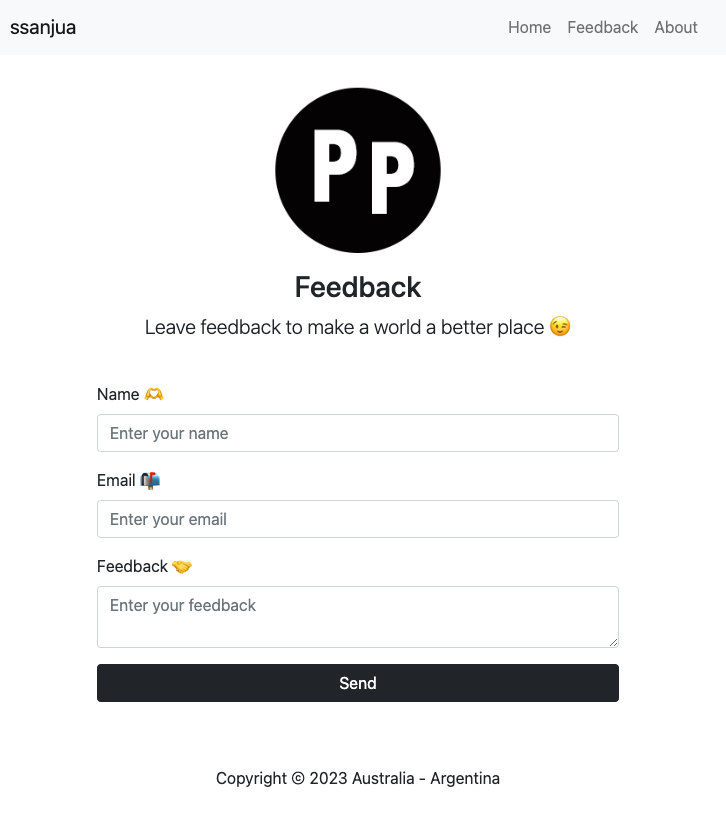

# Feedback App

`A simple web application built with PHP and MySQL that allows users to submit feedback.
`

## Features
- **Feedback Form:** Users can provide their name, email, and feedback.
- **Database Storage:** Submitted feedbacks are stored in a MySQL database.
- **Responsive Design:** Thanks to Bootstrap, the application is fully responsive and looks great on both mobile and desktop devices.

## Technologies Used
- Backend: **PHP**
- Database: **MySQL**
- Frontend: **HTML, CSS (Bootstrap)**
- Deployment Platform: **Railway**

  

## Local Setup
Clone this repository:

<pre><code>
git clone https://github.com/ssanjua/feedbackForm_php
</code></pre>

